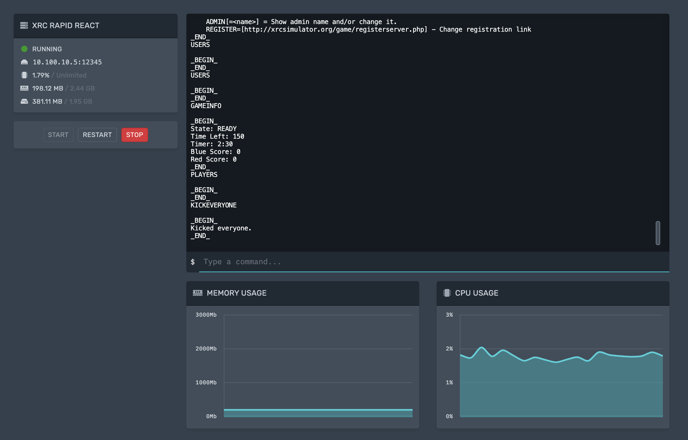
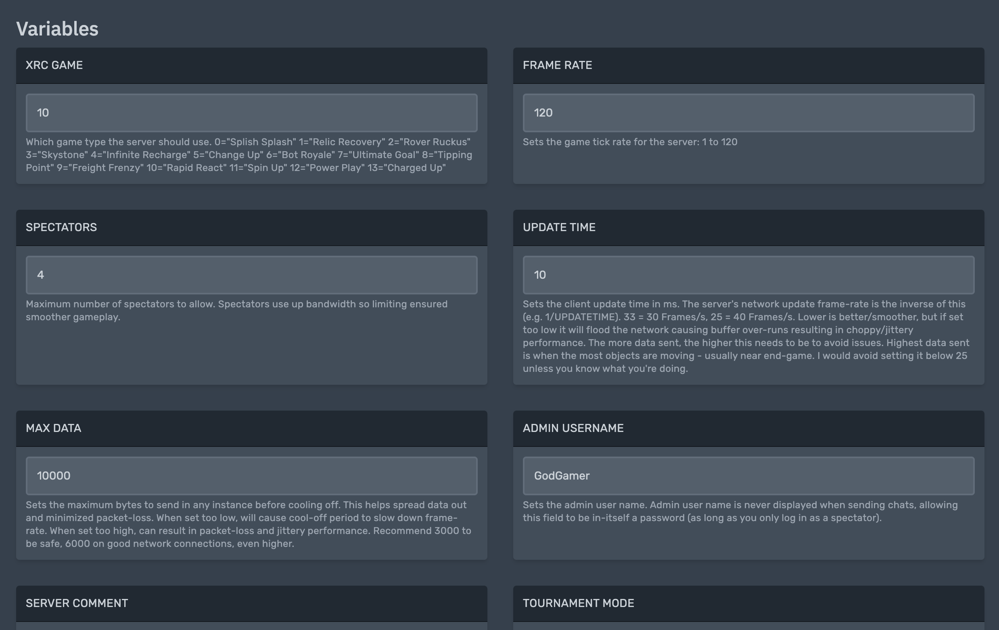

# xRC-Pterodactyl-Egg
A Pterodactyl panel egg for hosting [xRC Sim](https://xrcsimulator.org/) servers.

  |  
:-:|:-:

## Features

* One-click updating of the xRC server whenever an update is released! (simply choose "Reinstall server" to update to the latest version of xRC)
* Easily configure all the server settings from the web panel's variables page!
* Delegate users to help you manage your server!
* Conveniently manage your server from within your Pterodactyl panel!

## Installation

Prerequisite: This guide assumes you have admin access to a [Pterodactyl panel](https://pterodactyl.io/).

1. Download the [egg file](./egg-xrc-sim-server.json).
2. From your Pterodactyl admin panel, click `Nests` under `Service Management`.
3. Click `Import Egg`. Browse to select the egg file, and choose a nest to associate the egg with (this doesn't matter). Click `Import` to finish.
4. Create a new server using the newly imported egg!
